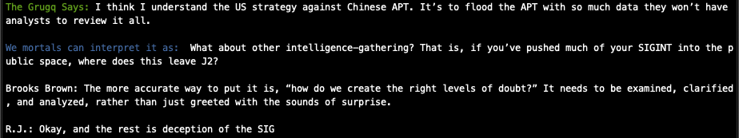

The Grugq, an OPSEC master, epic security mind and also close friend who often comes up with the best quotes. Quotes I often find myself using on a weekly basis. 

In light of the above, I felt it was time to make a tool to grab one of his many quotes and present them to me when I need them for [talks/emails/socials/whateva], and what better time to keep on learning Go than this?

Oh and AI. You always need AI

### How to run

First, make sure you have your OpenAI key set as an export, like:

```
export OPEN_API_KEY="b2ggeW91IGxpa2UgdG8gd2F0Y2ggaHVoPyBjb29sIGNvb2wg"
```

Then, if you have Go installed, it's as simple as:

```
go run main.go
```

and it should present something like this



### How to build

Windows

```
GOOS=windows GOARCH=amd64 go build -o bin/grugq-says.exe main.go
``` 

macOS

```
GOOS=darwin GOARCH=arm64 go build -o grugq-says main.go
```
Linux

```
GOOS=linux GOARCH=386 go build -o grugq-says main.go
```

### Updates

I do need to make the quotes.go file work better, so that's on the TODO